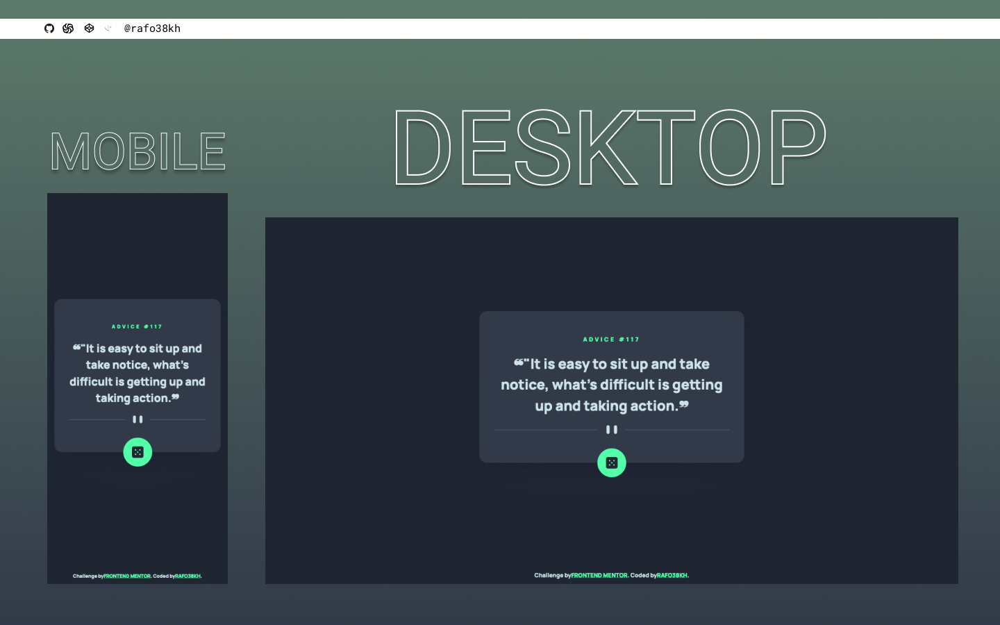

# Frontend Mentor - Advice Generator APP Solution

This is a solution to the [Advice Generator APP Challenge on Frontend Mentor](https://www.frontendmentor.io/challenges/advice-generator-app-QdUG-13db)

## Table of contents

- [Overview](#overview)
  - [The challenge](#the-challenge)
  - [Screenshot](#screenshot)
  - [Links](#links)
- [My process](#my-process)
  - [Built with](#built-with)
- [Author](#author)

## Overview

### The challenge

Users should be able to:

### Screenshot

### Links

- Solution URL: [https://www.frontendmentor.io/solutions/ddvice-generator-app-with-react-and-styled-components-O4bmlr_wW](https://www.frontendmentor.io/solutions/ddvice-generator-app-with-react-and-styled-components-O4bmlr_wW)
- Live Site URL: [https://rafo38kh.github.io/advice-generator-app/](https://rafo38kh.github.io/advice-generator-app/)

## My process

### Built with

- Semantic HTML5 markup
- CSS Flexbox
- CSS Grid
- Mobile-first workflow
- [React](https://reactjs.org/) - JS library
- [Styled Components](https://styled-components.com/) - For styles

## Author

- Frontend Mentor - [@rafo38kh](https://www.frontendmentor.io/profile/rafo38kh)
- GitHub - [@rafo38kh](https://github.com/rafo38kh)
- Codewars - [@rafo38kh](https://www.codewars.com/users/rafo38kh)
